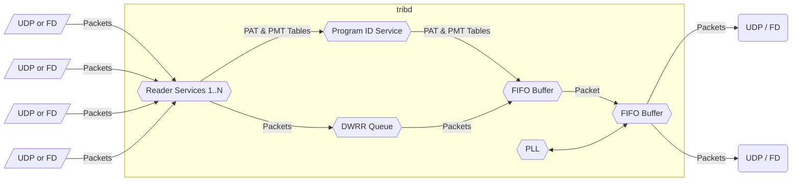
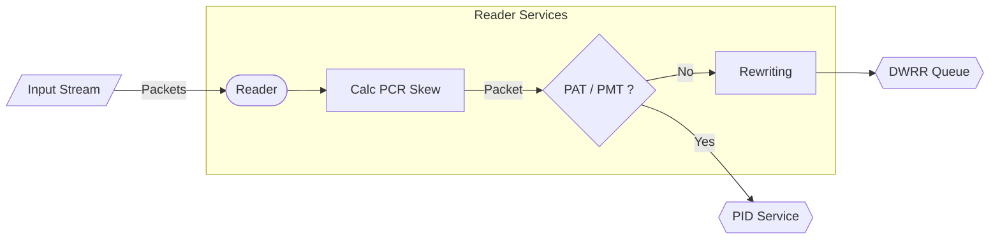
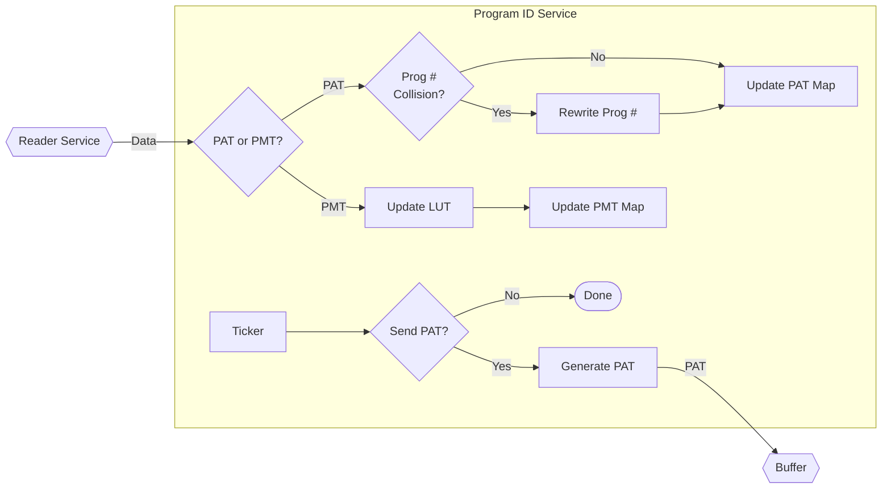
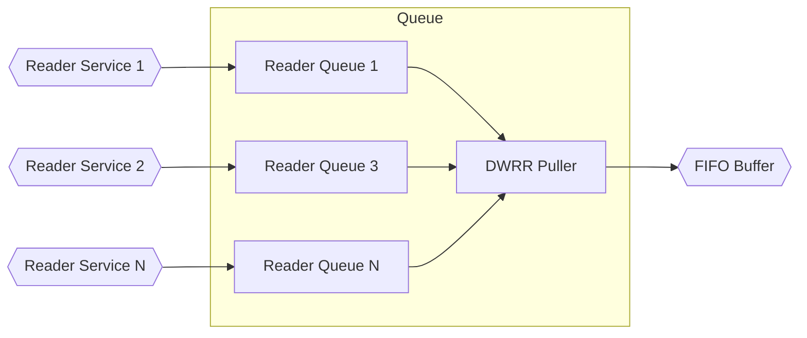
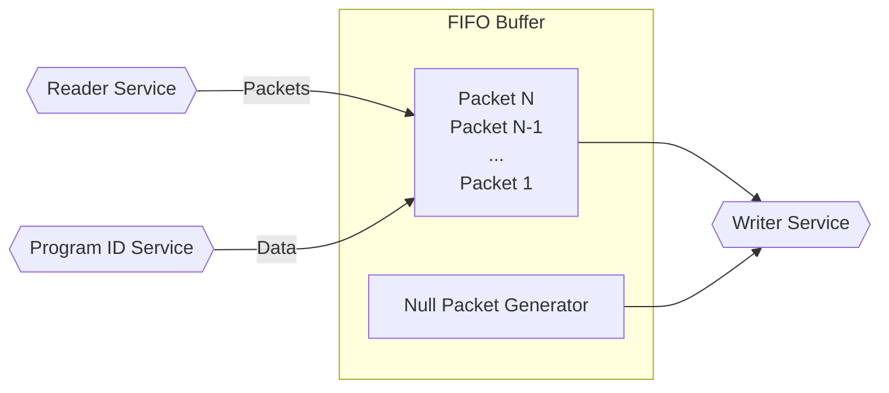
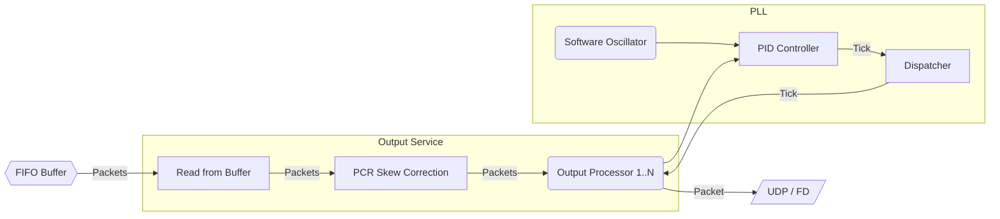

# tribd

## Architecture 

```mermaid
graph LR
    Input1_FD[/UDP or FD/] -->|Packets| Reader
    Input2_FD[/UDP or FD/] -->|Packets| Reader
    Input3_FD[/UDP or FD/] -->|Packets| Reader
    InputN_FD[/UDP or FD/] -->|Packets| Reader

    subgraph tribd
        Reader{{Reader Services 1..N}} --> |PAT & PMT Tables| PIDSvc
        PIDSvc{{Program ID Service}} --> |PAT & PMT Tables| MainBuffer{{FIFO Buffer}}

        Reader --> |Packets| Queue{{DWRR Queue}} --> |Packets| MainBuffer

        MainBuffer --> |Packet| Writer{{Writer Services 1..N}}
        PLL{{PLL}} <--> Writer{{FIFO Buffer}}
    end

    Writer -->|Packets| Output_FD1(UDP / FD)
    Writer -->|Packets| Output_FD2(UDP / FD)
```

### Reader Services

```mermaid
graph LR
    Start[/Input Stream/] --> |Packets| Input

    subgraph Reader Services
        Input([Reader]) --> Base_Time[Calc PCR Skew]
        Base_Time  --> |Packet| PAT_PMT
        PAT_PMT{PAT / PMT ?} --> |No| PIDs
    end

    PIDs[Rewriting] --> Queue{{DWRR Queue}}
    PAT_PMT --> |Yes| PIDService{{PID Service}}
```

### Program ID Service

```mermaid
graph LR
    ReaderService{{Reader Service}} --> |Data| PAT_PMT

    subgraph Program ID Service
        PAT_PMT{PAT or PMT?} --> |PAT| Collision
        Collision{Prog #\nCollision?} --> |No| UpdatePAT[Update PAT Map]
        Collision --> |Yes| Collided
        Collided[Rewrite Prog #] --> UpdatePAT
        
        PAT_PMT --> |PMT| LUT
        LUT[Update LUT] --> PMT_MAP[Update PMT Map]

        Clock[Ticker] --> Send?{Send PAT?}
        Send? --> |No| End([Done])
        Send? --> |Yes| Generate[Generate PAT]
    end

    Generate --> |PAT| Buffer{{Buffer}}
```

### Deficit Weighted Round Robin Queue

```mermaid
    graph LR
        Reader1{{Reader Service 1}} --> Q1
        Reader2{{Reader Service 2}} --> Q2
        ReaderN{{Reader Service N}} --> QN

        subgraph Queue
            Q1[Reader Queue 1] --> DWRR[DWRR Puller]
            Q2[Reader Queue 3] --> DWRR[DWRR Puller]
            QN[Reader Queue N] --> DWRR[DWRR Puller]

        end
        
        DWRR --> Buffer{{FIFO Buffer}}
```

### Main buffer

```mermaid
graph LR
    ReaderService{{Reader Service}} --> |Packets| Buffer
    PIDService{{Program ID Service}} --> |Data| Buffer

    subgraph FIFO Buffer
        Buffer["Packet N\nPacket N-1\n...\nPacket 1"]
        Null[Null Packet Generator]
    end

    Buffer --> Writer{{Writer Service}}
    Null --> Writer

```

### Writer services

```mermaid
    graph LR
        Buffer{{FIFO Buffer}} --> |Packets| Read

        subgraph Output Service
            Read[Read from Buffer] --> |Packets| Skew
            Skew[PCR Skew Correction] --> |Packets| OutputProcessor
        end

        subgraph PLL
            Oscillator(Software Oscillator) --> PID
            PID[PID Controller] -->|Tick| Dispatcher
            Dispatcher -->|Tick| OutputProcessor
            OutputProcessor --> PID        
        end
        
    OutputProcessor(Output Processor 1..N) -->|Packet| Output_FD1[/UDP / FD/]
```
